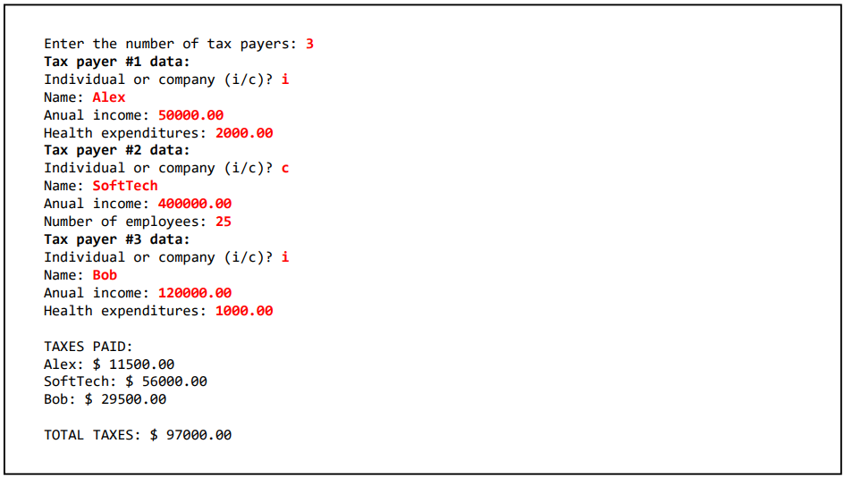
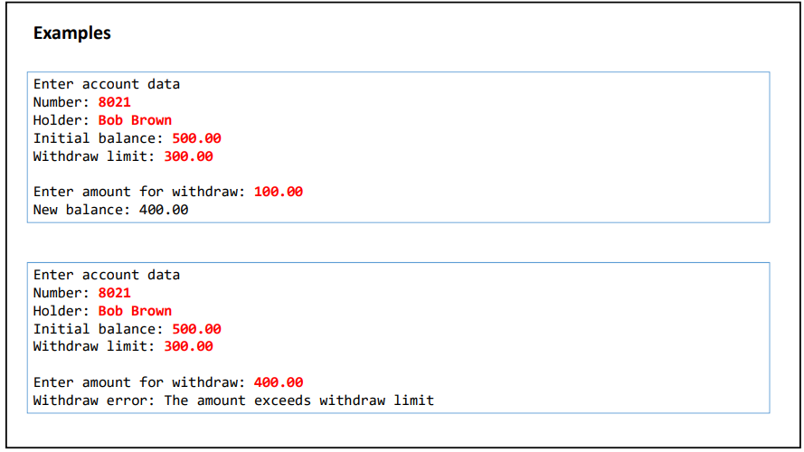

**EXERCÍCIO 01**

**Exercício: Implementação de Interface de Funcionários e Benefícios**

Você deve implementar um sistema para uma empresa que possui diversos tipos de funcionários. Cada funcionário pode receber diferentes tipos de benefícios, dependendo de sua função. O objetivo é usar interfaces para definir as funcionalidades comuns entre os tipos de funcionários, assim como para os benefícios.

### Requisitos:

1. **Interface `Funcionario`:**
    - Defina uma interface `Funcionario` que tenha os seguintes métodos:
        - `double calcularSalario();`
        - `String getNome();`
        - `String getFuncao();`
2. **Interface `Beneficio`:**
    - Crie outra interface `Beneficio` com os métodos:
        - `double calcularBeneficio();`
        - `String descricaoBeneficio();`
3. **Classes Implementadoras:**
    - Crie as classes `Gerente`, `Engenheiro` e `Estagiario` que implementam a interface `Funcionario`. Cada uma dessas classes deve calcular o salário de maneira diferente.
    - Crie classes específicas de benefícios, como `PlanoDeSaude`, `ValeRefeicao`, e `ValeTransporte`, que implementam a interface `Beneficio`.
4. **Classe de Funcionário com Benefícios:**
    - Crie uma classe `FuncionarioComBeneficio` que associa um funcionário a uma lista de benefícios (um funcionário pode ter mais de um benefício).
    - Essa classe deve ter um método para calcular o total de benefícios recebidos por um funcionário e também exibir todas as descrições dos benefícios.
5. **Main:**
    - No método principal (`public static void main(String[] args)`), crie uma lista de diferentes funcionários, adicione benefícios a eles e exiba o salário final (salário base + benefícios) e a descrição dos benefícios de cada um.

**Objetivo:**
O objetivo é praticar o uso de interfaces para abstrair funcionalidades comuns e permitir que diferentes tipos de objetos as implementem de maneira específica, seguindo o princípio de polimorfismo.

**EXERCÍCIO 02 - Herança e Polimorfismo**

Uma empresa possui funcionários próprios e terceirizados.
Para cada funcionário, deseja-se registrar nome, horas
trabalhadas e valor por hora. Funcionários terceirizado
possuem ainda uma despesa adicional.

O pagamento dos funcionários corresponde ao valor da hora
multiplicado pelas horas trabalhadas, sendo que os
funcionários terceirizados ainda recebem um bônus
correspondente a 110% de sua despesa adicional.

Fazer um programa para ler os dados de N funcionários (N
fornecido pelo usuário) e armazená-los em uma lista. Depois
de ler todos os dados, mostrar nome e pagamento de cada
funcionário na mesma ordem em que foram digitados.

**EXERCÍCIO 03 - Herança e Polimorfismo - Products list**

Fazer um programa para ler os dados de N
produtos (N fornecido pelo usuário). Ao final,
mostrar a etiqueta de preço de cada produto na
mesma ordem em que foram digitados.

Todo produto possui nome e preço. Produtos
importados possuem uma taxa de alfândega, e
produtos usados possuem data de fabricação.
Estes dados específicos devem ser
acrescentados na etiqueta de preço conforme
exemplo (próxima página). Para produtos
importados, a taxa e alfândega deve ser
acrescentada ao preço final do produto.

**EXERCÍCIO 04 - Taxes - Método abstrato**

Fazer um programa para ler os dados de N contribuintes (N fornecido pelo usuário), os quais
podem ser pessoa física ou pessoa jurídica, e depois mostrar o valor do imposto pago por cada um,
bem como o total de imposto arrecadado.
Os dados de pessoa física são: nome, renda anual e gastos com saúde. Os dados de pessoa jurídica
são nome, renda anual e número de funcionários. As regras para cálculo de imposto são as
seguintes:

Pessoa física: pessoas cuja renda foi abaixo de 20000.00 pagam 15% de imposto. Pessoas com
renda de 20000.00 em diante pagam 25% de imposto. Se a pessoa teve gastos com saúde, 50%
destes gastos são abatidos no imposto.
Exemplo: uma pessoa cuja renda foi 50000.00 e teve 2000.00 em gastos com saúde, o imposto
fica: (50000 * 25%) - (2000 * 50%) = 11500.00
Pessoa jurídica: pessoas jurídicas pagam 16% de imposto. Porém, se a empresa possuir mais de 10
funcionários, ela paga 14% de imposto.

Exemplo: uma empresa cuja renda foi 400000.00 e possui 25 funcionários, o imposto fica:
400000 * 14% = 56000.00

**EXERCÍCIO 05 - Account - Excepitons**

Fazer um programa para ler os dados de uma conta bancária e depois realizar um
saque nesta conta bancária, mostrando o novo saldo. Um saque não pode ocorrer
ou se não houver saldo na conta, ou se o valor do saque for superior ao limite de
saque da conta. 

